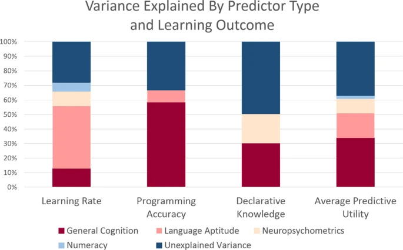

# Python for Linguists 2023

[Python basics ](../classes/02_Python_basics.md) (16/02) ►

-------

## Week 1: Introduction (9/02)


### Plan
1. Quiz
2. Homework discussion
3. Introduction
4. Practical


-------

### 1. Quiz

The quiz will be revealed during class.

-------

### 2. Homework for today

Exercises:
- [Section 0. Preparation (Python, PyCharm)](../exercises/00_preparation.md): all exercises

-------

### 3. Introduction


#### Why programming (for a linguist?)


#### Why Python?

[Python popularity](https://www.youtube.com/watch?v=qQXXI5QFUfw)

Python underlies: most deep learning/NLP, as well as Youtube, Google backend, Spotify, Reddit...

#### What is programming?


#### Natural language vs. programming language




From _Relating Natural Language Aptitude to Individual Differences in Learning Programming Languages_ (https://www.nature.com/articles/s41598-020-60661-8)


#### What is Python?

Compiled vs. interpreted programming language implementations.

Python is both:
- Python --[compiled into]--> Bytecode --[interpreted]--> Machine code

A simple Python program:
```python
a = 1234
b = 5678 
print(a + b)
```

Compiled into Bytecode:
```
01100100 00000000 01011010 00000000 01100100 00000001 01011010 00000001 01100101 00000010 01100101 00000000 01100101 00000001 00010111 00000000 10000011 00000001 00000001 00000000 01100100 00000010 01010011 00000000
```

Each byte corresponds to an instruction. More human-readable version of bytecode:
```
  1           0 LOAD_CONST               0 (1234)
              2 STORE_NAME               0 (a)
  2           4 LOAD_CONST               1 (5678)
              6 STORE_NAME               1 (b)
  3           8 LOAD_NAME                2 (print)
             10 LOAD_NAME                0 (a)
             12 LOAD_NAME                1 (b)
             14 BINARY_ADD
             16 CALL_FUNCTION            1
             18 POP_TOP
             20 LOAD_CONST               2 (None)
             22 RETURN_VALUE
```

The Bytecode gets sent to the Python interpreter, which is a computer program that reads the Bytecode and while doing so sends corresponding Machine Code instructions to the CPU.


#### Your dopamine levels throughout this course


#### This course

- Exercises
- Solutions (one week delay)
- Projects
- Classes
- Quizzes
- Submittables ✉️: submit on Brightspace _prior_ to the class when the homework is due, or earlier if you would like feedback on it during class.
- Midterm and final exam [in part written, in part programming] 

All files on Github; submit submittables through Brightspace.

```python
for student in students:
    num_submittables_passed = sum(grades[student][submittable] == 'pass' for submittable in all_submittables)
    if submittables_passed >= 0.8 * len(all_submittables):
        grades[student]['course'] = (grades[student]['midterm_exam'] + grades['final_exam']) / 2
    else:
        grades[student]['course'] = 1
```


#### Using ChatGPT?


-------

### 4. Practicum: homework for next time

Exercises:
- [Section 1. The Python Console, numbers and variables (=, +, %, ...)](../exercises/01_console_and_numbers.md): all exercises&nbsp;&nbsp;&nbsp;&nbsp;&nbsp; (`▂▁▁▁▁▁▁▁▂▁▁▁▁▁▁▂▁▁▁▁▁▄▅▁▂▂▁▂▁▄▅▁▁▂`)
- [Section 2. Logic (and, or, ==, =>, ...)](../exercises/02_logic.md): all exercises&nbsp;&nbsp;&nbsp;&nbsp;&nbsp; (`▂▁▁▁▁▂▁▁▁▁▁▁▂▂▄▅▁▄▅▂▁▁▂▂▂▁▁▁▁▂`)
- [Section 3. Strings ('...', +, len, [])](../exercises/03_strings.md): all exercises&nbsp;&nbsp;&nbsp;&nbsp;&nbsp; (`▁▁▁▁▁▁▁▁▁▁▁▁▂▁▂▁▂▂▁▁▁▁▁▁▁▁▁▁▂▁▁▁▄▅▁▁▁▁▁▁▁▁▁▁▁▁▂▂`)
- _(Optional)_ [Section 4. Python code and Bytecode](../exercises/04_python_and_bytecode.md): all exercises&nbsp;&nbsp;&nbsp;&nbsp;&nbsp; (`(▁▁▁▁▂▂▁▂▂)`)

